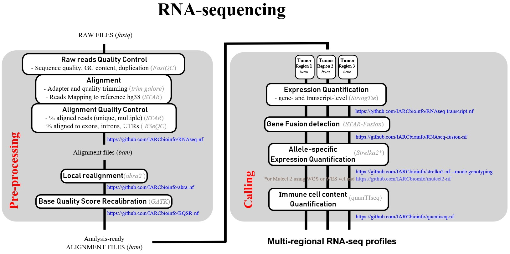

# IARC bioinformatics pipelines, tools and other resources (updated on 17/07/2025)

This page lists all the pipelines and tools developed at IARC (mostly nextflow pipelines which are suffixed with -nf). It includes also some useful ressources like courses, data notes, manuscripts code/datasets and tips/tricks. Finally at the bottom of the page you will also find explanations on how to use nextflow pipelines.

<ins>Table of Content:</ins>

[1. IARC pipelines/tools list](#head1)

 * [1a. Raw NGS data processing](#head1a)

 * [1b. RNA Seq](#head1b)

 * [1c. Single-cell RNA seq](#head1c)

 * [1d. QC](#head1d)

 * [1e. Variant calling](#head1e)
 
 * [1f. Deep learning pipelines and tools for digital pathology](#head1f)

	 * [1f1. Whole slide images (WSI) pre-processing](#head1f1)
	
	 * [1f2. Tumor segmentation](#head1f2)
	   
	 * [1f3. Supervised learning on immunohistochemistry slides](#head1f3)
	
	 * [1f4. Self-suprevised feature extractor for WSIs](#head1f4)
	   
	 * [1f5. Additional tools](#head1f5)

 * [1g. Other tools/pipelines](#head1g)
   


[2. Courses, data notes and manuscripts code/datasets](#head2)

[3. Tips & Tricks](#head3)

[comment]: <> (4. Coming soon - only dev branches yet - link to head4)

[4. Nextflow, Docker and Singularity installation and use](#head5)

 * [4a. Nextflow](#head5a)

 * [4b. Docker](#head5b)

 * [4c. Singularity](#head5c)

 * [4d. Usage](#head5d)

 * [4e. Updates](#head5e)

 * [4f. Help](#head5f)
   
[5. Outdated and unmaintained pipelines and tools](#head6)

## <a name="head1"></a>1. IARC pipelines/tools list

### <a name="head1a"></a>1a. Raw NGS data processing
| Name      |Latest version|Maintained | Description     |	Tools used	|
|-----------|--------------|-----------|-----------------|----------------------|
| [alignment-nf](https://github.com/IARCbioinfo/alignment-nf)    |v1.3 - March 2021|:heavy_check_mark: Yes| Performs BAM realignment or fastq alignment, with/without local indel realignment and base quality score recalibration |[bwa](https://github.com/lh3/bwa), [samblaster](https://github.com/GregoryFaust/samblaster), [sambamba](https://github.com/lomereiter/sambamba), [samtools](http://samtools.sourceforge.net/), [AdapterRemoval](https://github.com/MikkelSchubert/adapterremoval), [GATK](www.broadinstitute.org/gatk/download), [k8 javascript execution shell](https://sourceforge.net/projects/bio-bwa/files/bwakit/), [bwa-postalt.js](https://github.com/lh3/bwa/tree/master/bwakit) |
| [BQSR-nf](https://github.com/IARCbioinfo/BQSR-nf)   |v1.1 - Apr 2020|:heavy_check_mark: Yes| Performs base quality score recalibration of bam files using GATK |[samtools](http://samtools.sourceforge.net/), [samblaster](https://github.com/GregoryFaust/samblaster), [sambamba](https://github.com/lomereiter/sambamba), [GATK](www.broadinstitute.org/gatk/download)|
| [abra-nf](https://github.com/IARCbioinfo/abra-nf)   |v3.0 - Apr 2020|:heavy_check_mark: Yes| Runs ABRA (Assembly Based ReAligner) |[ABRA](https://github.com/mozack/abra), [bedtools](http://bedtools.readthedocs.io/en/latest/), [bwa](http://bio-bwa.sourceforge.net), [sambamba](http://lomereiter.github.io/sambamba/), [samtools](http://www.htslib.org/) |
| [gatk4-DataPreProcessing-nf](https://github.com/IARCbioinfo/gatk4-DataPreProcessing-nf)   |Nov 2018|?| Performs bwa alignment and pre-processing (mark duplicates and recalibration) following GATK4 best practices - compatible with hg38 |[bwa](https://github.com/lh3/bwa), [picard](https://broadinstitute.github.io/picard/), [GATK4](https://software.broadinstitute.org/gatk/download/), [sambamba](https://github.com/lomereiter/sambamba), [qualimap](http://qualimap.bioinfo.cipf.es/)|
| [PostAlignment-nf](https://github.com/IARCbioinfo/PostAlignment-nf)   |Aug 2018|?| Perform post alignment on bam files | [samtools](http://samtools.sourceforge.net/), [sambamba](https://github.com/lomereiter/sambamba), [bwa-postalt.js](https://github.com/lh3/bwa/tree/master/bwakit)|
|****************** |*********** |*********** |************************* |************************ |
| [marathon-wgs](https://github.com/IARCbioinfo/marathon-wgs)   |June 2018|?| Studies intratumor heterogeneity with Canopy|[bwa](https://github.com/lh3/bwa), [platypus](https://github.com/andyrimmer/Platypus), [strelka2](https://github.com/Illumina/strelka), [vt](https://github.com/atks/vt), [annovar](http://annovar.openbioinformatics.org/en/latest/), [R](https://www.r-project.org), [Falcon](https://cran.r-project.org/web/packages/falcon/index.html), [Canopy](https://github.com/yuchaojiang/Canopy)|
| [ITH-nf](https://github.com/IARCbioinfo/ITH-nf)   |Sept 2018|?| Perform intra-tumoral heterogeneity (ITH) analysis |[Strelka2](https://github.com/Illumina/strelka) , [Platypus](https://www.well.ox.ac.uk/platypus), [Bcftools](https://samtools.github.io/bcftools/bcftools.html), [Tabix](http://www.htslib.org/doc/tabix.html), [Falcon](https://omictools.com/falcon-3-tool), [Canopy](https://github.com/yuchaojiang/Canopy)|

### <a name="head1b">1b. RNA Seq
| Name      |Latest version|Maintained | Description     |	Tools used	|
|-----------|--------------|-----------|-----------------|----------------------|
| [RNAseq-nf](https://github.com/IARCbioinfo/RNAseq-nf)   |v2.4 - Dec 2020|:heavy_check_mark: Yes| Performs RNAseq mapping, quality control, and reads counting - See also [RNAseq_analysis_scripts](https://github.com/IARCbioinfo/RNAseq_analysis_scripts) for post-processing  |[fastqc](http://www.bioinformatics.babraham.ac.uk/projects/fastqc/INSTALL.txt), [RESeQC](http://rseqc.sourceforge.net/), [multiQC](http://multiqc.info/docs/), [STAR](https://github.com/alexdobin/STAR/blob/master/doc/STARmanual.pdf), [htseq](http://www-huber.embl.de/HTSeq/doc/install.html#install), [cutadapt](http://cutadapt.readthedocs.io/en/stable/installation.html), Python version > 2.7, [trim_galore](https://github.com/FelixKrueger/TrimGalore), [hisat2](https://ccb.jhu.edu/software/hisat2/index.shtml), [GATK](www.broadinstitute.org/gatk/download), [samtools](http://samtools.sourceforge.net/)|
| [RNAseq-transcript-nf](https://github.com/IARCbioinfo/RNAseq-transcript-nf)   |v2.2 - June 2020|:heavy_check_mark: Yes| Performs transcript identification and quantification from a series of BAM files |[StringTie](https://github.com/gpertea/stringtie)|
| [RNAseq-fusion-nf](https://github.com/IARCbioinfo/RNAseq-fusion-nf)   |v1.1 - Aug 2020|:heavy_check_mark: Yes| Perform fusion-genes discovery from RNAseq data using STAR-Fusion|[STAR-Fusion](https://github.com/STAR-Fusion/STAR-Fusion/wiki)|
| [gene-fusions-nf](https://github.com/IARCbioinfo/gene-fusions-nf)   |v1 - Oct 2020 - updated Nov 2021|:heavy_check_mark: Yes| Perform fusion-genes discovery from RNAseq data using Arriba|[Arriba](https://github.com/suhrig/arriba)|
| [quantiseq-nf](https://github.com/IARCbioinfo/quantiseq-nf)   |v1.1 - July 2020|:heavy_check_mark: Yes| Quantify immune cell content from RNA-seq data|[quanTIseq](https://icbi.i-med.ac.at/software/quantiseq/doc/) |
| [RNAsplicing-nf](https://github.com/IARCbioinfo/RNAsplicing-nf)   |v1.0 - April 2025|:heavy_check_mark: Yes| 🔴 NEW : Perform RNA splicing analyses using SUPPA2|trimgalore, salmon and [SUPPA2](https://github.com/comprna/SUPPA/wiki/SUPPA2-tutorial) |



### <a name="head1c">1c. Single-cell RNA seq
| Name      |Latest version|Maintained | Description     |	Tools used	|
|-----------|--------------|-----------|-----------------|----------------------|
| [singlecell_scripts](https://github.com/IARCbioinfo/singlecell_scripts)   |January 2025|:heavy_check_mark: Yes| 🔴 NEW : Python notebook for single-cell analyses following ['Single-cell best practices guide'](https://www.nature.com/articles/s41576-023-00586-w) | Python |
| [SComatic-nf](https://github.com/IARCbioinfo/SComatic-nf)   |April 2024|:heavy_check_mark: Yes| Performs variant calling from single-cell RNAseq data | [SComatic](https://github.com/cortes-ciriano-lab/SComatic), [annovar](https://annovar.openbioinformatics.org/en/latest/) | 
| [numbat-nf](https://github.com/IARCbioinfo/numbat-nf)   |April 2024|:heavy_check_mark: Yes| Performs variant calling from single-cell RNAseq data | [numbat](https://kharchenkolab.github.io/numbat/articles/numbat.html), [SigProfilerExtractor](https://github.com/AlexandrovLab/SigProfilerExtractor) |


### <a name="head1d">1d. QC
| Name      |Latest version|Maintained | Description     |	Tools used	|
|-----------|--------------|-----------|-----------------|----------------------|
| [NGSCheckMate](https://github.com/IARCbioinfo/NGSCheckMate)   |v1.1a - July 2021|:heavy_check_mark: Yes| Runs NGSCheckMate on BAM files to identify data files from a same indidual (i.e. check N/T pairs) |[NGSCheckMate](https://github.com/parklab/NGSCheckMate)|
| [conpair-nf](https://github.com/IARCbioinfo/conpair-nf)   |June 2018|?| Runs conpair (concordance and contamination estimator) |[conpair](https://github.com/nygenome/Conpair), [Python 2.7](www.python.org), [numpy 1.7.0 or higher](www.numpy.org), [scipy 0.14.0 or higher](www.scipy.org), [GATK 2.3 or higher](www.broadinstitute.org/gatk/download)|
| [damage-estimator-nf](https://github.com/IARCbioinfo/damage-estimator-nf)   |June 2017|?| Runs "Damage Estimator" |[Damage Estimator](https://github.com/Ettwiller/Damage-estimator), [samtools](http://samtools.sourceforge.net/), [R](https://www.r-project.org) with GGPLOT2 package|
| [QC3](https://github.com/IARCbioinfo/QC3)   |May 2016|No| Runs QC on DNA seq data (raw data, aligned data and variant calls - forked from [slzhao](https://github.com/slzhao/QC3) |[samtools](http://samtools.sourceforge.net/)|
| [fastqc-nf](https://github.com/IARCbioinfo/fastqc-nf)   |v1.1 - July 2020|:heavy_check_mark: Yes| Runs fastqc and multiqc on DNA seq data (fastq data) |[FastQC](https://www.bioinformatics.babraham.ac.uk/projects/fastqc/), [Multiqc](https://multiqc.info/)|
| [qualimap-nf](https://github.com/IARCbioinfo/qualimap-nf)   |v1.1 - Nov 2019|:heavy_check_mark: Yes| Performs quality control on bam files (WES, WGS and target alignment data) |[samtools](http://samtools.sourceforge.net/), [Qualimap](http://qualimap.bioinfo.cipf.es/), [Multiqc](https://multiqc.info/)|
| [mpileup-nf](https://github.com/IARCbioinfo/mpileup-nf)   |Jan 2018|?| Computes bam coverage with samtools mpileup (bed parallelization) |[samtools](http://samtools.sourceforge.net/),[annovar](http://annovar.openbioinformatics.org/en/latest/)|
| [bamsurgeon-nf](https://github.com/IARCbioinfo/bamsurgeon-nf)   |Mar 2019|?| Runs bamsurgeon (tool to add mutations to bam files) with step of variant simulation |[Python 2.7](www.python.org), [bamsurgeon](http://github.com/adamewing/bamsurgeon/), [R software](https://www.r-project.org/) (tested with R version 3.2.3)|

### <a name="head1e">1e. Variant calling
| Name      |Latest version|Maintained | Description     |	Tools used	|
|-----------|--------------|-----------|-----------------|----------------------|
| [needlestack](https://github.com/IARCbioinfo/needlestack)   |v1.1 - May 2019|:heavy_check_mark: Yes| Performs multi-sample somatic variant calling |[perl](https://www.perl.org),  [bedtools](http://bedtools.readthedocs.org/en/latest/), [samtools](http://samtools.sourceforge.net/) and [R software](https://www.r-project.org/) |
| [target-seq](https://github.com/IARCbioinfo/target-seq)   |Aug 2019|?| Whole pipeline to perform multi-sample somatic variant calling using Needlestack on targeted sequencing data|[abra2](https://github.com/IARCbioinfo/abra-nf),[QC3](https://github.com/slzhao/QC3) ,[needlestack](https://github.com/IARCbioinfo/needlestack), [annovar](http://annovar.openbioinformatics.org/en/latest/) and [R software](https://www.r-project.org/) |
| [strelka2-nf](https://github.com/IARCbioinfo/strelka2-nf)   |v1.2a - Dec 2020|:heavy_check_mark: Yes| Runs Strelka 2 (germline and somatic variant caller)|[Strelka2](https://github.com/Illumina/strelka)|
| [strelka-nf](https://github.com/IARCbioinfo/strelka-nf)   |Jun 2017|No| Runs Strelka (germline and somatic variant caller)|[Strelka](https://sites.google.com/site/strelkasomaticvariantcaller/home/strelka-workflow-installation)|
| [mutect-nf](https://github.com/IARCbioinfo/mutect-nf)   |v2.3 - July 2021|:heavy_check_mark: Yes| Runs Mutect on tumor-matched normal bam pairs |[Mutect](https://github.com/broadinstitute/mutect) and its dependencies (Java 1.7 and Maven 3.0+), [bedtools](http://bedtools.readthedocs.io/en/latest/content/installation.html)|
| [dupcaller-nf](https://github.com/IARCbioinfo/dupcaller-nf)   |v1.0 - July 2025|:heavy_check_mark: Yes| 🔴 NEW : Dupcaller pipeline for somatic variant calling with Nextflow |[Mutect](https://github.com/broadinstitute/mutect) and its dependencies (Java 1.7 and Maven 3.0+)|
| [gatk4-HaplotypeCaller-nf](https://github.com/IARCbioinfo/gatk4-HaplotypeCaller-nf)   |Dec 2019|?| Runs variant calling in GVCF mode on bam files following GATK best practices|[GATK](https://software.broadinstitute.org/gatk/download/)|
| [gatk4-GenotypeGVCFs-nf](https://github.com/IARCbioinfo/gatk4-GenotypeGVCFs-nf)   |Apr 2019|?| Runs joint genotyping on gvcf files following GATK best practices|[GATK](https://software.broadinstitute.org/gatk/download/)|
| [GVCF_pipeline-nf](https://github.com/IARCbioinfo/GVCF_pipeline-nf)   |Nov 2016|?| Performs bam realignment and recalibration + variant calling in GVCF mode following GATK best practices|[bwa](https://github.com/lh3/bwa), [samblaster](https://github.com/GregoryFaust/samblaster), [sambamba](https://github.com/lomereiter/sambamba), [GATK](https://software.broadinstitute.org/gatk/download/)|
| [platypus-nf](https://github.com/IARCbioinfo/platypus-nf)   |v1.0 - Apr 2018|?| Runs Platypus (germline variant caller) |[Platypus](https://github.com/andyrimmer/Platypus)|
| [TCGA_platypus-nf](https://github.com/IARCbioinfo/TCGA_platypus-nf)   |Aug 2018|?| Converts TCGA Platypus vcf in format for annotation with annovar |[vt](https://github.com/atks/vt),[VCFTools](https://github.com/vcftools/vcftools)|
| [vcf_normalization-nf](https://github.com/IARCbioinfo/vcf_normalization-nf)   |v1.1 - May 2020|:heavy_check_mark: Yes| Decomposes and normalizes variant calls (vcf files) |[bcftools](https://github.com/samtools/bcftools),[samtools/htslib](http://www.htslib.org/)|
| [TCGA_germline-nf](https://github.com/IARCbioinfo/TCGA_germline-nf) |May 2017|?| Extract germline variants from TCGA data for annotation with annovar (vcf files) |[R software](https://www.r-project.org/)|
| [gama_annot-nf](https://github.com/IARCbioinfo/gama_annot-nf) |Aug 2020|:heavy_check_mark: Yes| Filter and annotate batch of vcf files (annovar + strand + context) |[annovar](http://annovar.openbioinformatics.org/en/latest/), [R](https://www.r-project.org)|
| [table_annovar-nf](https://github.com/IARCbioinfo/table_annovar-nf) |v1.1.1 - Feb 2021|:heavy_check_mark: Yes| Annotate variants with annovar (vcf files) |[annovar](http://annovar.openbioinformatics.org/en/latest/)|
| [RF-mut-f](https://github.com/IARCbioinfo/RF-mut-f) |Nov 2021|:heavy_check_mark: Yes| Random forest implementation to filter germline mutations from tumor-only samples |[annovar](http://annovar.openbioinformatics.org/en/latest/)|
|****************** |*********** |*********** |************************* |************************ |
| [MutSig](https://github.com/IARCbioinfo/MutSig)   |Oct 2021|:heavy_check_mark: Yes| Pipeline to perform mutational signatures analysis of WGS data using SigProfilerExtractor |[SigProfilerExtractor](https://github.com/AlexandrovLab/SigProfilerExtractor)|
| [MutSpec](https://github.com/IARCbioinfo/mutspec)   |v2.0 - May 2017|?| Suite of tools for analyzing and interpreting mutational signatures |[annovar](http://annovar.openbioinformatics.org/en/latest/)|
|****************** |*********** |*********** |************************* |************************ |
| [purple-nf](https://github.com/IARCbioinfo/purple-nf)   |v1.1 - Nov 2021|:heavy_check_mark: Yes| Pipeline to perform copy number calling from tumor/normal or tumor-only sequencing data using PURPLE |[PURPLE](https://github.com/hartwigmedical/hmftools/tree/master/purple)|
| [facets-nf](https://github.com/IARCbioinfo/facets-nf)   |v2.0 - Oct 2020|:heavy_check_mark: Yes| Performs fraction and copy number estimate from tumor/normal sequencing data using facets |[facets](https://github.com/mskcc/facets) , [R](https://www.r-project.org) |
| [CODEX-nf](https://github.com/IARCbioinfo/CODEX-nf)   |Mar 2017|?| Performs copy number variant calling from whole exome sequencing data using CODEX |[R](https://www.r-project.org) with package Codex, Rscript |
| [svaba-nf](https://github.com/IARCbioinfo/svaba-nf)   |v1.0 - August 2020|:heavy_check_mark: Yes| Performs structural variant calling using SvABA |[SvABA](https://github.com/walaj/svaba) , [R](https://www.r-project.org) |
| [sv_somatic_cns-nf](https://github.com/IARCbioinfo/sv_somatic_cns-nf)   |v1.0 - Nov 2021|:heavy_check_mark: Yes| Pipeline using multiple SV callers for consensus structural variant calling from tumor/normal sequencing data |[Delly](https://github.com/dellytools/delly), [SvABA](https://github.com/walaj/svaba), [Manta](https://github.com/Illumina/manta), [SURVIVOR](https://github.com/fritzsedlazeck/SURVIVOR), [bcftools](https://github.com/samtools/bcftools), [Samtools](https://github.com/samtools/samtools) |
| [ssvht](https://github.com/IARCbioinfo/ssvht)   |v1 - Oct 2022|:heavy_check_mark: Yes| 🔴 NEW set of scripts to assist the calling of somatic structural variants from short reads using a random forest classifier ||

### <a name="head1f">1f. Deep learning pipelines and tools for digital pathology

#### <a name="head1f1">1f1.  Whole slide images (WSI) pre-processing

| Name      |Latest version|Maintained | Description     |	Tools used	|
|-----------|--------------|-----------|-----------------|----------------------|
| [WSIPreprocessing](https://github.com/IARCbioinfo/WSIPreprocessing)   |December 2023|:heavy_check_mark: Yes| Preprocessing pipeline for WSIs (Tiling, color normalization) | Python, openslide |

#### <a name="head1f2">1f2. Tumor segmentation with CFlow AD

| Name      |Latest version|Maintained | Description     |	Tools used	|
|-----------|--------------|-----------|-----------------|----------------------|
| [TumorSegmentationCFlowAD](https://github.com/IARCbioinfo/TumorSegmentationCFlowAD)   |December 2023|:heavy_check_mark: Yes| Tumour segmentation with an anomaly detection model | Python, PyTorch |

#### <a name="head1f3">1f3. Supervised learning on immunohistochemistry slides

| Name      |Latest version|Maintained | Description     |	Tools used	|
|-----------|--------------|-----------|-----------------|----------------------|
| [PathonetLNEN](https://github.com/IARCbioinfo/PathonetLNEN)   |December 2023|:heavy_check_mark: Yes| Detection and classification of cells as positive or negative for an immunomarker developed for PHH3 and Ki-67 in lung carcinoma. | Python, TensorFlow |

#### <a name="head1f4">1f4. Self-suprevised feature extractor for WSIs

| Name      |Latest version|Maintained | Description     |	Tools used	|
|-----------|--------------|-----------|-----------------|----------------------|
| [LNENBarlowTwins](https://github.com/IARCbioinfo/LNENBarlowTwins)   |December 2023|:heavy_check_mark: Yes| Extractions of HE tiles features with Barlow Twins a self-supervised deep learning model. | Python, Pytorch |

#### <a name="head1f5">1f5. Additional tools

| Name      |Latest version|Maintained | Description     |	Tools used	|
|-----------|--------------|-----------|-----------------|----------------------|
| [SpatialPCAForWSIs](https://github.com/IARCbioinfo/SpatialPCAForWSIs)   |December 2023|:heavy_check_mark: Yes| Spatially aware principal component analysis to obtain a low-dimensional representation of the tiles encoding vectors. | R |
| [LeidenForTilesCommunity_accGPU](https://github.com/IARCbioinfo/LeidenForTilesCommunity_accGPU)   |December 2024|:heavy_check_mark: Yes| tools for GPU-accelerated Leiden community detection using the RAPIDS package (focus on clustering encoded vectors from high-dimensional data) | |


### <a name="head1g">1g. Other tools/pipelines
| Name      |Latest version|Maintained | Description     |	Tools used	|
|-----------|--------------|-----------|-----------------|----------------------|
| [template-nf](https://github.com/IARCbioinfo/template-nf)   |May 2020|:heavy_check_mark: Yes | Empty template for nextflow pipelines |NA|
| [data_test](https://github.com/IARCbioinfo/data_test)   |Aug 2020|:heavy_check_mark: Yes| Small data files to test IARC nextflow pipelines |NA|
||||
| [bam2cram-nf](https://github.com/IARCbioinfo/bam2cram-nf)   |v1.0 - Nov 2020|:heavy_check_mark: Yes|Pipeline to convert bam files to cram files|[samtools](http://samtools.sourceforge.net/)|
| [DPclust-nf](https://github.com/IARCbioinfo/DPclust-nf)   | |:heavy_check_mark: Yes|Method for subclonal reconstruction using SNVs and/or CNAs from whole genome or whole exome sequencing data|[dpclust](https://github.com/Wedge-lab/dpclust) , [R](https://www.r-project.org) |
| [ITH_pipeline](https://github.com/IARCbioinfo/ITH_pipeline)   | |:heavy_check_mark: Yes|Study intra-tumoral heterogeneity (ITH) through subclonality reconstruction |[HATCHet](https://github.com/raphael-group/hatchet) , [DeCiFer](https://github.com/raphael-group/decifer), [ClonEvol](https://github.com/hdng/clonevol)|
| [hla-neo-nf](https://github.com/IARCbioinfo/hla-neo-nf)   |v1.1 - June 2021|:heavy_check_mark: Yes|Pipeline to predict neoantigens from WGS of T/N pairs |[xHLA](https://github.com/humanlongevity/HLA), [VEP](https://github.com/Ensembl/ensembl-vep), [pVACtools](https://github.com/griffithlab/pVACtools)|
| [PRSice](https://github.com/IARCbioinfo/PRSice-nf)   |Nov 2020|| Pipeline to compute polygenic risk scores|[PRSice-2](https://www.prsice.info/)|
| [methylkey](https://github.com/IARCbioinfo/methylkey)   | Nov 2024 |:heavy_check_mark: Yes|Pipeline for 450k and 850k array analysis (bisulfite data analysis using Minfi, Methylumi, Comet, Bumphunter and DMRcate packages)|[R software](https://www.r-project.org/)|
| [bam2peaks](https://github.com/IARCbioinfo/bam2peaks-nf)   | Oct 2024 |:heavy_check_mark: Yes|🔴 NEW Pipeline designed for peak calling using MACS and IDR, coupled with QC generation using deeptools|[MACS](https://github.com/macs3-project/MACS), [IDR](https://github.com/nboley/idr),[Deeptools](https://github.com/deeptools/deepTools)|
| [wsearch-nf](https://github.com/IARCbioinfo/wsearch-nf)   | July 2022 |:heavy_check_mark: Yes|Microbiome analysis with usearch, vsearch and phyloseq||
| [AmpliconArchitect-nf](https://github.com/IARCbioinfo/ampliconarchitect-nf)   |v1.0 - Oct 2021 |:heavy_check_mark: Yes| Discovers ecDNA in cancer genomes using AmpliconArchitect |[AmpliconArchitect](https://github.com/virajbdeshpande/AmpliconArchitect)|
| [addreplacerg-nf](https://github.com/IARCbioinfo/addreplacerg-nf)   |Jan 2017|?| Adds and replaces read group tags in BAM files |[samtools](http://samtools.sourceforge.net/)|
| [bametrics-nf](https://github.com/IARCbioinfo/bametrics-nf)   |Mar 2017|?| Computes average metrics from reads that overlap a given set of positions |NA|
| [Gviz_multiAlignments](https://github.com/IARCbioinfo/Gviz_multiAlignments)   |Aug 2017|?| Generates multiple BAM alignments views using Gviz bioconductor package|[Gviz](https://bioconductor.org/packages/release/bioc/html/Gviz.html)||
| [nf_coverage_demo](https://github.com/IARCbioinfo/nf_coverage_demo)   |v2.3 - July 2020|:heavy_check_mark: Yes| Plots mean coverage over a series of BAM files |[bedtools](http://bedtools.readthedocs.io/en/latest/), [R software](https://www.r-project.org/)|
| [LiftOver-nf](https://github.com/IARCbioinfo/LiftOver-nf) |Nov 2017|?| Converts BED/VCF between hg19 and hg38 |[picard](https://broadinstitute.github.io/picard/)|
| [MinION_pipes](https://github.com/IARCbioinfo/MinION_pipes)   |Jan 2020|?| Analyze MinION sequencing data for the reconstruction of viral genomes |Guppy V3.1.5+, Porechop V0.2.4, Nanofilt V2.2.0, Filtlong V0.2.0, SPAdes V3.10.1, CAP3 02/10/15, BLAST V2.9.0+, MUSCLE V3.8.1551, Nanopolish V0.11.0, Minimap2 V2.15, Samtools version 1.9|
| [DraftPolisher](https://github.com/IARCbioinfo/DraftPolisher)   |Jan 2020|?| Fast polishing of draft sequences (draft genome assembly) |[MUSCLE](http://drive5.com/muscle/downloads.htm), [Python3](https://www.python.org/downloads/release/python-360/) |
| [Imputation-nf](https://github.com/IARCbioinfo/Imputation-nf)   |v1.1 - July 2021|:heavy_check_mark: Yes| Pipeline to perform dataset genotyping imputation |LiftOver, Plink, Admixture, Perl, Term::ReadKey, Becftools, Eagle, Minimac4 and samtools|
| [PVAmpliconFinder](https://github.com/IARCbioinfo/PVAmpliconFinder)   |Aug 2020|:heavy_check_mark: Yes| Identify and classify known and potentially new papilliomaviridae sequences from amplicon deep-sequencing with degenerated papillomavirus primers.|Python and Perl + FastQC, MultiQC, Trim Galore, VSEARCH, Blast, RaxML-EPA, PaPaRa, CAP3, KRONA)|
| [integration_analysis_scripts](https://github.com/IARCbioinfo/integration_analysis_scripts)   |Mar 2020|:heavy_check_mark: Yes| Performs unsupervised analyses (clustering) from transformed expression data (e.g., log fpkm) and methylation beta values |[R software](https://www.r-project.org/) with iClusterPlus, gplots and lattice R packages|
| [mpileup2readcounts](https://github.com/IARCbioinfo/mpileup2readcounts)|Apr 2018|?| Get the readcounts at a locus by piping samtools mpileup output - forked from [gatoravi](https://github.com/gatoravi/mpileup2readcounts) |[samtools](http://samtools.sourceforge.net/)|
| [Methylation_analysis_scripts](https://github.com/IARCbioinfo/Methylation_analysis_scripts)   |v1.0 - June 2020 - updated Nov 2021|:heavy_check_mark: Yes| Perform Illumina EPIC 850K array pre-processing and QC from idat files|[R software](https://www.r-project.org)| 
| [DRMetrics](https://github.com/IARCbioinfo/DRMetrics)   |Oct 2020|:heavy_check_mark: Yes| Evaluate the quality of projections obtained after using dimensionality reduction techniques|[R software](https://www.r-project.org/)|
| [acnviewer-singularity](https://github.com/IARCbioinfo/acnviewer-singularity)   |Jul 2019|?| Build a singularity image of aCNViewer (tool for visualization of absolute copy number and copy neutral variations) (|[Singularity](https://sylabs.io/singularity/)|
| [polysolver-singularity](https://github.com/IARCbioinfo/polysolver-singularity)   |Dec 2019|?| Build a singularity image of Polysolver (tool for HLA typing based on whole exome seq)|[Singularity](https://sylabs.io/singularity/)|
| [scanMyWorkDir](https://github.com/IARCbioinfo/scanMyWorkDir)   |May 2018|?| Non-destructive and informative scan of a nextflow work folder |NA|

## <a name="head2">2. Courses, data notes and manuscripts code/datasets
| Name      | Description     |
|-----------|-----------------|
| [nextflow-course-2018](https://github.com/IARCbioinfo/nextflow-course-2018)   | Nextflow course |
| [SBG-CGC_course2018](https://github.com/IARCbioinfo/SBG-CGC_course2018)   | Analyzing TCGA data in SBG-CGC |
| [Medical Genomics Course](https://github.com/IARCbioinfo/medical_genomics_course)   | Medical Genomics course held at the INSA Lyon - updated Fall 2024 |
| [intro-cancer-genomics](https://github.com/IARCbioinfo/intro-cancer-genomics)   | Introduction to cancer genomics |
| [mesomics_data_note](https://github.com/IARCbioinfo/mesomics_data_note)   | Repository with code and datasets used in the [mesomics data note manuscript: Di Genova et al.](https://academic.oup.com/gigascience/article/doi/10.1093/gigascience/giac128/7007909?login=true) |
| [MESOMICS_data](https://github.com/IARCbioinfo/MESOMICS_data)   | Repository with data and processing scripts associated with the MESOMICS project and [main analysis paper: Mangiante et al.](https://www.nature.com/articles/s41588-023-01321-1) |
| [MS_lungNENomics](https://github.com/IARCbioinfo/MS_lungNENomics)   | Repository with scripts from the lungNENomics manuscript Sexton-Oates et al. 2025 |
| [MS_SVA](https://github.com/IARCbioinfo/MS_SVA)   | with code used to produce the figures from [Morrison et al.](https://www.medrxiv.org/content/10.1101/2023.11.23.23298821v1) |
| [MS-EPIC-RareCancers](https://github.com/IARCbioinfo/MS-EPIC-RareCancers)   | Repository with scripts used in EPIC rare cancer project manuscript from [Fernandez-Cuesta, Voegele et al.](https://www.esmorarecancers.org/article/S3050-4619(25)00013-9/fulltext) |

## <a name="head3">3.Tips & Tricks
| Name      |Latest version|Maintained | Description     |	Tools used	|
|-----------|--------------|-----------|-----------------|----------------------|
| [BAM-tricks](https://github.com/IARCbioinfo/BAM-tricks)   ||| Tips and tricks for BAM files |[samtools](http://samtools.sourceforge.net/), freebayes, [bedtools](http://bedtools.readthedocs.io/en/latest/), biobambam2, [Picard](http://broadinstitute.github.io/picard/), [rbamtools](https://cran.r-project.org/web/packages/rbamtools/index.html)|
| [VCF-tricks](https://github.com/IARCbioinfo/VCF-tricks) ||| Tips and tricks for VCF files |[samtools](http://samtools.sourceforge.net/),[bcftools](https://github.com/samtools/bcftools), [vcflib](https://github.com/vcflib/vcflib), [vcftools](https://github.com/vcftools/vcftools), R scripts|
| [R-tricks](https://github.com/IARCbioinfo/R-tricks)||| Tips and tricks for R |NA|
| [EGA-tricks](https://github.com/IARCbioinfo/EGA-tricks)||| Tips and tricks to use the European Genome-Phenome Archive from the European Bioinformatics Institute |[EGA client](https://www.ebi.ac.uk/ega/sites/ebi.ac.uk.ega/files/documents/EGA_download_client_2.2.2.zip)|
| [GDC-tricks](https://github.com/IARCbioinfo/GDC-tricks)||| Tips and tricks to use the [GDC data portal](https://gdc-portal.nci.nih.gov/) |NA|
| [awesomeTCGA](https://github.com/IARCbioinfo/awesome-TCGA) ||| Curated list of resources to access TCGA data |NA|
| [LSF-Tricks](https://github.com/IARCbioinfo/LSF-tricks)   ||| Tips and tricks for LSF HPC scheduler |NA|

[comment]: <> (## <a name="head4">4. Coming soon)
[comment]: <> (| Name      | Description     |	Tools used	| )
[comment]: <> (|-----------|-----------------|----------------------| - cf Nextflow_DSL2 link: https://github.com/IARCbioinfo/Nextflow_DSL2 - Rwith modules for nextflow DSL2 |NA|)  

## <a name="head5">4. Nextflow, Docker and Singularity installation and use

### <a name="head5a">4a. Nextflow

1. Install [java](https://java.com/download/) JRE if you don't already have it (7 or higher).

2. Install [nextflow](http://www.nextflow.io/).

	```bash
	curl -fsSL get.nextflow.io | bash
	```
	And move it to a location in your `$PATH` (`/usr/local/bin` for example here):
	```bash
	sudo mv nextflow /usr/local/bin
	```

### <a name="head5b">4b. Docker

To avoid having to installing all dependencies each time you use a pipeline, you can instead install [docker](https://www.docker.com) and let nextflow dealing with it. Installing docker is system specific (but quite easy in most cases), follow  [docker documentation](https://docs.docker.com/installation/) (docker CE is sufficient). Also follow the post-installation step to manage Docker as a non-root user ([here](https://docs.docker.com/engine/installation/linux/linux-postinstall/) for Linux), otherwise you will need to change the `sudo` option in nextflow `docker` config scope as described in the nextflow documentation [here](https://www.nextflow.io/docs/latest/config.html#scope-docker).

To run nextflow pipeline with Docker, simply add the `-with-docker` option in the `nextflow run` command.

### <a name="head5c">4c. Singularity

To avoid having to installing all dependencies each time you use a pipeline, you can also install [singularity](https://www.docker.com) and let nextflow dealing with it. 

See documentation [here](https://sylabs.io/guides/3.5/user-guide/).

In case you want to use the same singularity container - with the exactly same versions of pipeline and tools - on several data over time you may want to pull the container and archive it somewhere :
```bash
singularity pull shub://IARCbioinfo/pipeline-nf:v2.2
```
where "pipeline-nf" should be replaced by the name of the pipeline you want to use (example: RNAseq-nf) and 2.2 by the version of the pipeline you want to use (example: 2.4) This will create a singularity container file: pipeline-nf_v2.2.sif (example: RNAseq-nf_v2.4.sif) that you can then use by specifying it in the nextflow command (see usage)

=> example:
```bash
singularity pull shub://IARCbioinfo/RNAseq-nf:v2.4
```

### <a name="head5d">4d. Usage

```bash
nextflow run iarcbioinfo/pipeline_name -r X --input_folder xxx --output_folder xxx -params-file xxx.yml -w /scratch/work
```
OR USING SINGULARITY
```bash
nextflow run iarcbioinfo/pipeline_name -r X -profile singularity --input_folder xxx --output_folder xxx -params-file xxx.yml -w /scratch/work
```
OR USING SINGULARITY WITH SPECIFIC CONTAINER
```bash
nextflow run iarcbioinfo/pipeline_name -r X -with-singularity XXX.sif --input_folder xxx --output_folder xxx -params-file xxx.yml -w /scratch/work
```

### <a name="head5e">4e. Updates

You can update the nextflow sofware and the pipeline itself simply using:
```bash
nextflow -self-update
nextflow pull iarcbioinfo/pipeline_name
```

You can also automatically update the pipeline when you run it by adding the option `-latest` in the `nextflow run` command. Doing so you will always run the latest version from Github.

### <a name="head5f">4f. Help

```bash
nextflow run iarcbioinfo/pipeline_name --help
```

## <a name="head6">5. Outdated and unmaintained pipelines and tools

| Name      |Latest version|Maintained | Description     |	Tools used	|
|-----------|--------------|-----------|-----------------|----------------------|
| [GATK-Alignment-nf](https://github.com/IARCbioinfo/GATK-Alignment-nf)   |June 2017|No| Performs bwa alignment and pre-processing (realignment and recalibration) following first version of GATK best practices (less performant than [alignment-nf](https://github.com/IARCbioinfo/alignment-nf) ) |[bwa](https://github.com/lh3/bwa), [picard](https://broadinstitute.github.io/picard/), [GATK](www.broadinstitute.org/gatk/download)|
